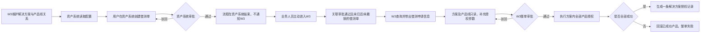

# 解决方案型测试授权申请概要方案

> 文档状态：概要方案（核心业务流程已确认，审批节点、权限及接口字段待开发评审）
>
> 最后更新：2026-08-06
>
> 适用范围：关联新资产系统借测单的解决方案型申请，以及 W3 本地创建的纯软件解决方案型申请

## 1. 背景与目标

解决方案型测试授权通常包含多个产品线。W3 负责维护“解决方案与产品线”的配置关系，并向新资产系统提供查询能力；新资产系统使用该关系完成借测申请，但不会在审批通过后向 W3 推送消息，也不会触发 W3 自动创建授权记录。

业务人员完成借测审批后，需要主动进入 W3，关联符合条件的借测单并重新发起解决方案型授权申请。W3 查询借测单中的申请信息，锁定已审批的方案和产品线，经过 W3 整单审批后执行实际授权并生成一条解决方案授权记录。

本方案目标：

1. 由 W3 统一维护解决方案与产品线关系，避免两个系统重复维护。
2. 资产借测审批与 W3 授权审批保持独立，职责清晰、状态互不自动驱动。
3. 通过借测单复用客户、方案、产品线、设备和借测期限等已审批信息，减少重复录入。
4. 确保 W3 申请中的产品线与资产审批内容一致，不允许申请人自行调整。
5. 一套解决方案只形成一张审批单和一条授权记录，方案内全部产品成功才算整单成功。

## 2. 核心结论

1. **配置归属 W3**：W3 提供配置页，只维护解决方案与产品线的对应关系，不维护产品授权参数、硬件规则或软件规则。
2. **资产系统只读取配置数据**：资产系统通过接口获取启用状态的解决方案及产品线关系，不打开或嵌入 W3 配置页。
3. **两个申请流程相互独立**：资产系统审批通过后不发送消息给 W3，W3 不自动创建申请、授权任务或授权记录。
4. **业务人员主动回到 W3 申请**：用户在 W3 关联借测单，系统查询并带出资产申请信息，再由用户补充授权参数后提交。
5. **借测单有明确准入条件**：W3 只能关联“审批通过且未归还、未撤销”的借测单。
6. **产品线不可调整**：方案和产品线以借测单中已审批的信息为准，在 W3 只读展示，不允许增加、删除或替换。
7. **设备与 XaaS 可并存**：一个解决方案的产品线可同时包含设备产品线（硬件授权）与 XaaS 产品线（SaaS 云服务授权），两类可混排于同一方案；含 XaaS 产品线时授权须以客户云图身份（云图账号 + 云图ID）为准。
8. **W3 重新审批**：关联借测单发起的申请仍需重新走 W3 审批；资产审批不能替代授权审批。
9. **一整单审批**：解决方案作为一张申请单整体审批，不拆分为多张产品线审批单。
10. **整单原子成功**：任一产品授权失败，整套解决方案失败，并回滚本次已成功创建的产品授权。
11. **一条授权记录**：沿用现有授权记录预留结构，以一条 `SOL-...` 记录展示，展开后查看产品明细。
12. **纯软件方案可由 W3 本地创建**：无需借测单，但同样需要走 W3 整单审批，并复用相同的授权和记录规则。

## 3. 系统边界

### 3.1 系统职责

| 系统 | 负责 | 不负责 |
|------|------|--------|
| W3 测试授权系统 | 维护解决方案与产品线关系；向资产系统提供配置查询；查询借测单；创建解决方案申请；执行 W3 整单审批；生成实际授权和授权记录 | 不创建或修改资产借测单；不替代资产系统审批；不接受资产审批结果自动建单 |
| 新资产系统 | 读取 W3 的解决方案与产品线关系；创建和审批借测单；保存本次借测选择的方案、产品线及其他申请信息；向 W3 提供借测单查询 | 不创建 W3 授权申请；不触发 W3 自动授权；不维护 W3 的解决方案配置页 |
| 许可证平台或其他下游系统 | 接收 W3 的产品授权请求；返回授权结果；提供撤销或作废能力 | 不处理解决方案业务审批和借测单校验 |

### 3.2 数据归属

| 数据 | 权威系统 | 说明 |
|------|----------|------|
| 解决方案与产品线关系 | W3 | 由 W3 配置页维护，资产系统只读获取 |
| 借测单及资产审批状态 | 新资产系统 | W3 只读查询，不修改 |
| 本次借测选择的方案和产品线 | 新资产系统 | 作为资产审批内容保存，W3 申请时原样带出并锁定 |
| W3 解决方案申请及审批 | W3 | 与资产审批相互独立 |
| 产品授权参数和授权结果 | W3 / 下游许可证平台 | 由 W3 申请补充并执行 |
| 解决方案授权记录 | W3 | 一条记录包含多个产品明细 |

## 4. 业务流程

### 4.1 关联借测单的解决方案申请

1. W3 配置管理员维护解决方案及其产品线关系。
2. 新资产系统通过接口读取可用方案及产品线关系，供用户创建借测单时选择。
3. 新资产系统独立完成借测审批，审批通过后不调用 W3 创建授权。
4. 业务人员主动进入 W3，搜索并关联符合条件的借测单。
5. W3 根据借测单查询资产申请全部信息，带出方案、产品线、客户、设备和借测期限等内容；产品线可能同时包含设备产品线与 XaaS 产品线。
6. 方案和产品线保持只读；用户仅补充实际授权所需参数。含 XaaS 产品线时，所用客户须具备云图身份（云图账号 + 云图ID）。
7. 用户提交一张解决方案申请，整单进入 W3 审批。
8. 审批通过后执行全部产品授权（设备线与 XaaS 线一并执行），全部成功后生成一条解决方案授权记录。

### 4.2 纯软件解决方案申请

1. 用户直接在 W3 创建纯软件解决方案申请，无需关联借测单。
2. 用户选择 W3 已启用的解决方案，系统带出对应产品线且不允许调整；产品线可同时含设备产品线与 XaaS 产品线。
3. 用户补充客户、有效期及各产品授权参数后提交。含 XaaS 产品线时，所用客户须具备云图身份。
4. 申请作为一整单进入 W3 审批，驳回后允许修改并重新提交。
5. 审批通过后的授权执行和授权记录结构与关联借测单场景一致。

## 5. 功能方案

### 5.1 解决方案与产品线配置

#### 1、初始状态

1. W3 提供独立的解决方案配置页，供具备配置权限的用户维护。
2. 配置对象仅包含解决方案基础信息、关联产品线和启停状态。
3. 配置页不维护版本、设备、授权模块、容量、有效期等具体授权参数。
4. 已启用配置可被新资产系统查询，也可供 W3 本地申请选择。
5. 关联产品线可为设备产品线或 XaaS 产品线（SaaS 云服务），二者可并存于同一方案。

#### 2、交互逻辑说明

1. 用户可新增解决方案并选择一个或多个产品线，可同时勾选设备产品线与 XaaS 产品线。
2. 用户可编辑方案名称和产品线关系，也可启用或停用方案。
3. 停用后不再出现在新申请的可选范围中，但不影响历史借测单和历史授权记录展示。
4. 资产系统仅通过接口读取配置数据，不进入该配置页面。

#### 3、字段校验规则

1. 方案编码：必填，在 W3 内唯一。
2. 方案名称：必填，在有效配置中不可重复。
3. 产品线：必填，至少选择一个有效产品线（可为设备产品线或 XaaS 产品线），不允许同一产品线重复添加。
4. 启停状态：必填，默认建议为启用。

#### 4、提交逻辑处理

1. 提交前校验方案编码、名称和产品线关系。
2. 保存成功后更新 W3 配置数据，资产系统后续查询可获得最新启用配置。
3. 配置修改不反向覆盖已经完成审批的借测单；历史借测单以资产系统保存的申请内容为准。

#### 5、验收标准

1. 可新增、编辑、启用和停用解决方案配置。
2. 每个方案至少关联一个产品线，重复编码、名称或产品线能被正确拦截。
3. 资产系统只能读取启用配置，无法通过查询接口修改配置。
4. 修改或停用配置不会改变历史借测单和历史授权记录。
5. 一个方案可同时关联设备产品线与 XaaS 产品线，配置与带出均支持并存。

---

### 5.2 借测单关联与信息带出

#### 1、初始状态

1. W3 解决方案申请提供借测单关联入口。
2. 可关联范围仅包括审批通过且当前未归还、未撤销的借测单。
3. 关联成功后带出借测单中的全部可用申请信息，其中方案和产品线只读；带出的产品线可同时含设备产品线与 XaaS 产品线。

#### 2、交互逻辑说明

1. 用户通过借测单号或其他可检索条件查找借测单。
2. W3 实时查询新资产系统并校验借测单状态。
3. 校验通过后带出借测单号、申请人、客户、方案、产品线、设备、借测期限及审批信息。
4. 用户不可增加、删除或替换借测单带出的产品线。
5. 用户可继续填写版本、设备 ID、授权模块、规格参数和授权有效期等 W3 授权信息；XaaS 产品线按对应云服务参数（如日志量、测试场景等）填写，不填设备 ID/SN。

#### 3、字段校验规则

1. 借测单：必填，必须真实存在且状态为审批通过、未归还、未撤销。
2. 解决方案：必须由借测单带出，不允许手工修改。
3. 产品线：必须与借测单已审批内容一致，不允许调整。
4. 借测单返回信息不完整或查询失败时，不允许提交 W3 申请。
5. 含 XaaS 产品线时，所用客户必须具有云图身份（云图账号 + 云图ID）；身份缺失或未被授权时不允许提交。

#### 4、提交逻辑处理

1. 提交时同时保存借测单号、资产申请标识、资产审批信息和带出的方案及产品线快照。
2. W3 不向新资产系统发送申请提交或审批结果。
3. 提交后生成一张 W3 解决方案申请单并进入整单审批。

#### 5、验收标准

1. 只有审批通过且未归还、未撤销的借测单可以关联。
2. 不符合条件的借测单无法进入申请，并显示明确原因。
3. 关联成功后可完整带出资产申请信息。
4. 方案和产品线只读，任何方式均无法在 W3 调整。
5. 提交后进入 W3 审批，不会自动生成授权记录。
6. 带出的产品线可为设备线与 XaaS 线并存，XaaS 线授权以客户云图身份为准，身份缺失无法提交。

---

### 5.3 W3 本地纯软件解决方案申请

#### 1、初始状态

1. W3 为纯软件解决方案提供独立申请入口，不要求关联借测单。
2. 用户从 W3 已启用配置中选择解决方案，系统自动带出产品线。
3. 产品线只读，不允许调整；可同时含设备产品线与 XaaS 产品线。

#### 2、交互逻辑说明

1. 用户选择解决方案后填写客户、有效期及各产品授权参数；含 XaaS 产品线时按对应云服务参数填写并校验客户云图身份。
2. 用户提交后进入 W3 整单审批。
3. 审批驳回后保留原申请内容，允许修改并重新提交。
4. 全流程不创建或修改新资产系统借测单，也不向新资产系统发送业务数据。

#### 3、字段校验规则

1. 解决方案、客户、申请人、授权有效期及全部产品必填参数必须完整。
2. 解决方案必须处于启用状态。
3. 产品线必须来自解决方案配置，不允许手工增删。
4. 含 XaaS 产品线时，所用客户必须具有云图身份（云图账号 + 云图ID）。

#### 4、提交逻辑处理

1. 提交后生成 W3 本地唯一申请编号并进入整单审批。
2. 审批通过前不执行实际授权。
3. 审批通过后进入与借测单关联场景相同的整单授权流程。

#### 5、验收标准

1. 纯软件方案可以不关联借测单独立申请。
2. 产品线正确带出且不可调整。
3. 申请必须经过 W3 审批，驳回后可修改重提。
4. 审批通过后生成与其他解决方案一致的一条授权记录。
5. 本地申请含 XaaS 产品线时同样校验客户云图身份，缺身份无法提交。

---

### 5.4 解决方案整单审批与授权

#### 1、初始状态

1. 一套解决方案对应一张 W3 申请单和一个整体审批状态。
2. 审批详情中展示方案基本信息、借测信息（如有）、产品线及各产品授权参数。
3. 产品线不拆分为独立审批单；设备产品线与 XaaS 产品线同属一张单，一并审批、一并执行，原子规则对两类一视同仁。

#### 2、交互逻辑说明

1. 审批人按整套解决方案进行通过或驳回。
2. 任一审批节点驳回时整单驳回，申请人修改后重新提交。
3. 全部审批节点通过后，W3 对方案内全部产品（设备产品线与 XaaS 产品线）进行预校验。
4. 预校验全部通过后执行实际授权；任一产品失败时停止处理并回滚已成功产品。

#### 3、字段校验规则

1. 审批前必须具备完整的方案、产品线和产品授权参数。
2. 关联借测单场景在提交及执行前均需校验借测单仍满足准入条件。
3. 所有产品必须通过预校验，整单才可进入实际授权。

#### 4、提交逻辑处理

1. 审批通过后按整单生成授权任务。
2. 全部产品授权成功后，整单状态更新为已授权。
3. 任一产品失败时撤销本次已成功产品，整单状态更新为失败，不提供部分可用结果。
4. 回滚失败时转人工补偿，相关授权结果保持不可交付状态。

#### 5、验收标准

1. 解决方案只生成一张审批单，不按产品线拆单。
2. 整单驳回后不会执行任何产品授权。
3. 只有所有产品均成功时整单才显示已授权。
4. 任一产品失败时已成功产品均被回滚，不存在部分成功状态。

---

### 5.5 解决方案授权记录

#### 1、初始状态

1. W3 授权记录列表中，一套解决方案只展示一条 `SOL-...` 记录，并标记授权类型为“解决方案”。
2. 记录行沿用现有原型预留字段：申请编号、申请平台、方案名称、客户、设备数量、区域、授权有效期、申请人、申请时间和整体状态。
3. 展开记录后展示产品线、版本、区域、有效期和授权码等产品明细；其中设备产品线展示设备 ID/设备 SN，XaaS 产品线展示云图ID。

#### 2、交互逻辑说明

1. 用户可展开或收起解决方案记录查看产品明细。
2. 产品明细不作为独立授权记录出现在主列表。
3. 搜索支持借测单号、方案名称、客户和方案内产品线。
4. 纯软件方案支持整套复制申请和一键续期，不支持选择部分产品。

#### 3、字段校验规则

1. 每条解决方案记录至少包含一条产品明细。
2. 整体状态由全部产品结果汇总生成，不允许人工直接修改。
3. 只有全部产品成功时整体状态才能为已授权。

#### 4、提交逻辑处理

1. 全部产品成功后保存一条解决方案记录及其产品明细、审批信息和申请快照。
2. 失败记录保存失败产品、失败步骤和回滚结果，但不提供可使用的授权结果。
3. 单产品授权记录的原有展示和操作不受影响。

#### 5、验收标准

1. 一条解决方案记录可完整展示方案内全部产品。
2. 产品明细数量与提交审批时的产品线及授权对象一致。
3. 可从记录追溯到 W3 申请、借测单（如有）和审批信息。
4. 现有授权记录中预留的展开结构得到复用。
5. 一条记录内的产品明细可同时含设备行（设备 ID/SN）与 XaaS 行（云图ID），两者同属一套方案。

---

### 5.6 设备与 XaaS 并存

> 本节集中说明「一个解决方案同时含设备产品线与 XaaS 产品线」的场景，配套其它小节共同生效。

#### 1、初始状态

1. 解决方案的产品线分为两类形态：设备产品线（硬件/软件设备授权）与 XaaS 产品线（SaaS 云服务授权），两类可同时存在于一个方案中。
2. 含 XaaS 产品线的方案，其授权对象以客户云图账号下的云图ID（tenantId）为准，而非设备 ID/SN。

#### 2、交互逻辑说明

1. 配置、借测单带出与本地申请均可出现设备线与 XaaS 线并存的方案，产品线一律只读。
2. 工作台按产品线形态分别渲染参数：设备线要求设备 ID/SN、授权模块等；XaaS 线要求对应云服务参数（如日志量、测试场景、是否 PK 等），并辅以客户信息收集表等材料。
3. 客户具备单个云图账号时自动关联并隐藏云图选择字段；存在多个云图账号时才需选择。

#### 3、字段校验规则

1. 含 XaaS 产品线时，所用客户必须具有云图身份（云图账号 + 云图ID）。
2. XaaS 产品线的必填参数必须完整，未填齐全不允许提交。
3. 设备线与 XaaS 线的校验在同一张申请内一并执行，任一不通过均阻止整单提交或整单失败。

#### 4、提交逻辑处理

1. 设备线与 XaaS 线作为一套解决方案一并提交、一并审批、一并执行授权。
2. 任一产品（设备或 XaaS）失败时整单失败并回滚本次已成功产品。

#### 5、验收标准

1. 一个方案可同时含设备线与 XaaS 线并完整走完申请、审批、授权与记录全流程。
2. XaaS 线授权展示云图ID，设备线展示设备 ID/SN，二者在一条方案记录内共存且互不影响。
3. 缺云图身份客户无法提交含 XaaS 线的方案，且提示补齐云图身份。

## 6. 数据与接口建议

### 6.1 W3 解决方案配置查询

资产系统调用 W3 查询启用的解决方案与产品线关系。接口只需提供方案标识、方案名称、启停状态及产品线标识和名称（产品线需能区分设备线与 XaaS 线），不返回具体授权规则和参数。

### 6.2 新资产系统借测单查询

W3 在用户主动关联借测单时查询新资产系统，建议返回：借测单号、资产申请标识、审批状态、申请人、客户、方案、产品线、设备 ID/SN、借测期限、归还状态、撤销状态及审批信息；含 XaaS 产品线时还需返回客户的云图账号与云图ID。

新资产系统应返回借测审批时保存的方案和产品线，不应根据 W3 当前最新配置重新计算，以避免历史审批内容发生变化。

### 6.3 系统触发边界

1. 新资产系统审批通过后不向 W3 发送消息。
2. W3 不轮询资产审批结果，不自动创建解决方案申请、授权任务或授权记录。
3. W3 仅在用户主动搜索、关联或提交时查询借测单信息。
4. W3 审批和授权结果暂不回传新资产系统。

## 7. 异常与一致性处理

| 异常场景 | 处理原则 |
|----------|----------|
| 借测单不存在 | 不允许关联，提示用户核对借测单号 |
| 借测单未审批通过 | 不允许关联，提示当前审批状态 |
| 借测单已归还或已撤销 | 不允许关联或继续提交 |
| 借测信息查询失败 | 保留用户已填写内容，不允许提交，支持重新查询 |
| 借测单方案或产品线缺失 | 不允许提交，提示返回资产系统核对申请信息 |
| W3 当前配置与借测单产品线不同 | 以借测审批时保存的产品线为准，不允许用户修改 |
| 方案含 XaaS 产品线但客户无云图身份 | 不允许提交，提示补全客户的云图账号与云图ID |
| 方案配置已停用 | 不影响已审批借测单的关联；是否允许继续申请由业务规则评审确认 |
| 重复关联同一借测单 | 是否允许创建多张 W3 申请需业务确认；系统至少提示已有申请 |
| 个别产品授权失败 | 整单失败并回滚本次已成功产品 |
| 产品授权回滚失败 | 整单保持失败并进入人工补偿，结果不可交付 |

## 8. 一期范围

### 8.1 一期纳入

1. W3 解决方案与产品线配置页。
2. 资产系统查询 W3 解决方案配置的接口。
3. W3 借测单搜索、状态校验和申请信息带出。
4. 借测单带出的方案和产品线只读锁定。
5. 关联借测单后的 W3 解决方案整单申请和审批。
6. 纯软件方案的 W3 本地申请和整单审批。
7. 全产品授权预校验、整单执行、失败回滚和人工补偿。
8. 一条解决方案授权记录及产品明细展开。
9. 设备产品线与 XaaS 产品线并存的解决方案申请、整单审批与授权（含客户云图身份校验）。
10. 纯软件方案记录的整套复制申请和一键续期。

### 8.2 一期不纳入

1. 新资产系统审批后自动通知 W3 或自动创建授权。
2. W3 修改资产借测单或资产审批结果。
3. W3 申请中增加、删除或替换借测单带出的产品线。
4. 配置页维护具体产品授权参数、硬件规则或软件规则。
5. 解决方案按产品线拆分审批或允许部分产品成功。
6. W3 向新资产系统回传审批或授权结果。
7. 复制申请和一键续期时选择部分产品。

## 9. 已确认结论与待确认项

### 9.1 已确认结论

| 序号 | 事项 | 确认结论 |
|------|------|----------|
| 1 | 配置页范围 | 由 W3 维护，只配置解决方案与产品线关系 |
| 2 | 资产系统使用方式 | 通过接口读取配置数据，不打开 W3 配置页 |
| 3 | 资产审批后处理 | 不发送消息，不触发 W3 自动建单或生成授权记录 |
| 4 | W3 申请入口 | 业务人员主动进入 W3，关联借测单后发起申请 |
| 5 | 借测单准入 | 仅审批通过且未归还、未撤销的借测单可关联 |
| 6 | 信息获取范围 | W3 可获取借测单全部申请信息 |
| 7 | 产品线调整 | 借测单带出的产品线不允许调整 |
| 8 | W3 审批 | 关联借测单和 W3 本地创建的申请均需 W3 审批 |
| 9 | 审批粒度 | 一套解决方案作为一整单审批，不按产品线拆单 |
| 10 | 授权结果 | 全部产品成功才算成功，任一失败则整单失败并回滚 |
| 11 | 授权记录 | 一套方案生成一条记录，展开查看产品明细 |
| 12 | W3 本地承接 | 纯软件解决方案可不关联借测单，在 W3 内闭环申请 |
| 13 | 设备与 XaaS 并存 | 一个解决方案可同时含设备产品线与 XaaS 产品线，一并整单审批与授权；XaaS 线授权以客户云图身份为准 |

### 9.2 待确认项

| 序号 | 事项 | 影响范围 |
|------|------|----------|
| 1 | W3 整单审批的节点数量、审批人和审批规则 | 审批流及审批页面 |
| 2 | 解决方案配置页的维护角色、权限范围和审计要求 | 配置页权限 |
| 3 | 同一借测单是否允许创建多张 W3 解决方案申请 | 防重复规则 |
| 4 | 配置停用后，已审批但尚未在 W3 申请的借测单是否仍可继续 | 历史兼容规则 |
| 5 | 资产借测单延期、归还后，W3 如何获知并处理已有授权 | 后续变更流程 |
| 6 | 下游许可证平台是否支持全部产品撤销或作废 | 整单失败回滚 |
| 7 | 两个查询接口的字段、认证、超时和错误码 | 系统联调 |

## 10. 验收口径摘要

1. W3 可维护解决方案与产品线关系，资产系统只能读取启用配置。
2. 新资产系统审批通过后不会自动在 W3 生成任何申请或授权记录。
3. 用户只能关联审批通过且未归还、未撤销的借测单。
4. W3 可完整带出借测申请信息，方案和产品线不可调整。
5. 关联借测单后必须重新提交 W3 整单审批。
6. 一套解决方案只生成一张 W3 审批单和一条授权记录。
7. 只有全部产品授权成功时整单才显示已授权；任一产品失败时整单失败并完成回滚。
8. 解决方案授权记录可展开查看全部产品明细，且不影响现有单产品记录。
9. 纯软件方案可在 W3 独立申请，但同样需要整单审批并遵守相同授权规则。
10. 一个解决方案可同时含设备产品线与 XaaS 产品线，并存授权、整单成功；XaaS 线以客户云图身份为准，缺身份无法提交。
