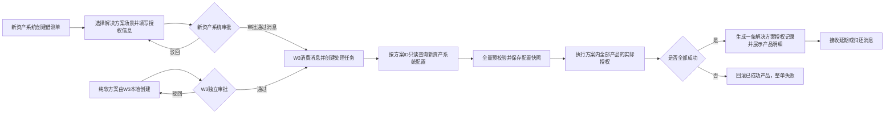

# 解决方案型测试授权申请概要方案

> 文档状态：概要方案（业务规则已与业务方逐项确认，见第 9 节；W3 审批节点、入口权限及接口细节待后续对齐）  
> 适用范围：由新资产系统借测场景触发，以及部分由 W3 承接创建的解决方案型、多产品测试授权申请

## 1. 背景与目标

解决方案型测试授权通常同时包含多个硬件或软件产品。主要流程由申请人在新资产系统创建借测单、选择解决方案场景、填写授权信息并完成审批；新资产系统审批通过后发送消息，W3 根据方案配置创建一条解决方案授权记录并完成实际授权生成。另有纯软件产品的解决方案型申请由 W3 提供创建入口并在 W3 内闭环处理（含 W3 独立审批），不创建或关联新资产系统借测单，也不向新资产系统发送申请、审批或处理结果。

本方案目标：

1. 新资产系统来源以借测单作为业务申请载体；W3 本地来源使用独立申请单在 W3 内闭环处理。
2. 以方案 ID 作为多产品配置索引，减少重复录入和人工拆单。
3. 在 W3 中形成一条可追溯的解决方案授权记录，并可展开查看多个产品授权明细。
4. 由 W3 承接实际授权生成，确保方案内全部产品同时成功，否则整单失败。
5. 明确两个系统的数据归属、异常补偿和幂等规则，避免重复建单或产生可用的部分授权结果。

## 2. 方案结论

1. **主要申请和审批入口在新资产系统**：用户创建借测单时选择解决方案场景，由新资产系统负责方案选择、授权信息填写和审批。
2. **审批按是否涉及硬件分流**：所有解决方案型申请均需审批。涉及硬件的方案一律在新资产系统申请并审批；纯软件方案由 W3 提供申请入口，走 W3 独立审批流，审批驳回允许修改后重提，在本系统内完成申请及后续处理，不创建、不关联新资产系统借测单，也不向新资产系统发送业务消息。
3. **新资产系统通过消息触发 W3**：审批通过后发送消息，W3 消费消息并按方案 ID 查询完整配置。
4. **方案配置归属新资产系统**：W3 只读查询和保存执行快照，不提供修改方案配置的能力。
5. **W3 同时负责记录和实际授权生成**：不是仅落一条业务记录，还需要执行方案内各产品的实际授权创建。
6. **用户侧只展示一条解决方案授权记录**：沿用当前授权记录预留结构，以 `SOL-...` 记录展示，展开后查看方案内产品明细；产品明细不是独立的用户侧授权记录。
7. **整单原子成功**：方案内全部产品授权成功后整单才成功；任一产品失败，整套解决方案均判定失败，不存在“部分成功”业务状态。
8. **暂不向新资产系统回传处理结果**：W3 在本系统内记录处理状态和失败原因，当前阶段不发送结果回执。
9. **后续变更仅有延期和归还两类**：借测单延期或归还时，新资产系统通过消息通知 W3 处理；撤销无业务场景，方案不允许调整。纯软方案（W3 本地来源）的延期由用户在 W3 内直接操作，无归还场景。

## 3. 系统边界

| 系统 | 负责内容 | 权威数据 |
|------|----------|----------|
| 新资产系统 | 创建借测单、提供解决方案场景选择、填写授权信息、发起及完成审批、维护方案配置、发送审批及后续变更消息 | 借测单、审批结果、方案定义、硬件及软件规则 |
| W3 测试授权系统 | 消费新资产系统消息、只读查询并校验方案配置、承接纯软申请本地闭环创建及独立审批、执行实际授权、生成一条解决方案记录、展示产品明细和异常、处理后续变更 | W3 本地申请单、解决方案授权记录、产品授权结果、处理状态、失败原因、配置快照 |
| 许可证平台或其他下游系统 | 接收 W3 的各产品授权请求，并提供创建、撤销或回滚能力 | 各产品实际授权结果 |

边界原则：

1. W3 不允许修改新资产系统中的借测单、审批结果和方案定义。
2. W3 可补充授权执行过程产生的数据，如解决方案记录 ID、产品授权码、处理状态和失败原因。
3. 新资产系统中的源数据发生变化时，不直接覆盖已生成记录，必须通过延期或归还消息处理。
4. 当前阶段 W3 的处理结果不回传新资产系统。
5. W3 本地创建的申请不在新资产系统生成借测单，不向新资产系统发送申请或状态消息；仅在执行时只读查询方案配置。

## 4. 总体流程

正常流程：

1. 申请人在新资产系统创建借测单，选择“解决方案型”方案并填写授权相关信息。
2. 新资产系统执行原有审批流程；驳回后返回原申请修改并重新提交。
3. 审批通过后，新资产系统发送包含借测号、借测方案 ID 及审批凭证的消息。
4. W3 消费消息后，使用方案 ID 只读查询方案基础信息、产品清单、硬件规则和软件规则。
5. W3 对全部产品配置进行预校验并保存本次配置快照。
6. W3 执行方案内全部产品的实际授权创建；全部成功后，生成一条 `SOL-...` 解决方案授权记录，记录内包含各产品授权明细。
7. 任一产品失败时，W3 回滚本次已成功创建的产品授权，整套解决方案记录标记为失败，不对用户暴露部分可用结果。
8. 新资产系统后续发送延期或归还消息，W3 按整套解决方案维度执行对应变更；纯软方案的延期由用户在 W3 内直接操作。
9. 纯软解决方案型申请直接在 W3 创建，走 W3 独立审批流，驳回后允许修改重提；全程不进入新资产系统，也不创建或关联借测单，审批通过后进入相同的配置校验、实际授权和记录生成流程。

## 5. 功能方案

### 5.1 新资产系统申请与审批

#### 1、初始状态

1. 用户创建借测申请时选择业务场景；选择具体解决方案型场景后，展示方案选择和授权相关信息填写区域。
2. 选择解决方案后，展示方案标识、方案名称及其所需的授权信息。
3. 方案及其硬件、软件规则由新资产系统维护；W3 只读使用，不提供编辑入口。

#### 2、交互逻辑说明

1. 申请人选择方案并填写信息后提交审批。
2. 审批驳回时返回原借测单，保留原填写内容并允许修改后重提。
3. 审批通过时发送消息触发 W3 接入流程，同一次审批结果不得重复触发多份 W3 记录。
4. 借测单延期或归还时发送对应变更消息。

#### 3、字段校验规则

1. 借测号、方案 ID、申请人、客户、授权有效期和审批凭证为建议必填项。
2. 借测场景必须明确标识为解决方案型，方案必须处于有效状态，并至少包含一个可授权产品。
3. 方案内硬件、软件规则按各产品规则分别校验。

#### 4、提交逻辑处理

1. 审批未通过时不通知 W3 创建记录。
2. 审批通过后发送包含最小业务标识和审批凭证的消息，完整方案配置由 W3 主动查询，避免消息过大或配置口径不一致。
3. 消息发送失败时由新资产系统重试，并保留消息日志。
4. 当前阶段不要求接收 W3 的授权处理结果回执。

#### 5、验收标准

1. 审批驳回不会在 W3 生成授权记录。
2. 审批通过消息可唯一定位借测单和方案配置。
3. 同一审批结果重复发送时，W3 只生成一条解决方案授权记录。
4. 延期、归还均能发送独立、可追踪的变更消息。

---

### 5.2 W3 消息接入与配置解析

#### 1、初始状态

1. W3 提供解决方案型消息接入能力，并标记来源系统为新资产系统。
2. 新任务初始状态建议为“待拉取配置”，后续状态包括“处理中、已完成、失败”，不设置“部分成功”或“部分失败”。
3. W3 不为该类任务生成本地审批单。

#### 2、交互逻辑说明

1. 消费审批通过消息后，先执行来源校验和幂等校验。
2. 根据方案 ID 查询方案配置，解析产品清单以及各产品的硬件、软件规则。
3. 查询失败或配置不完整时不执行任何产品授权，任务进入失败状态并支持自动重试和人工重试。
4. 校验通过后保存配置快照，确保后续可以还原“按哪一版配置创建”。

#### 3、字段校验规则

1. 消息至少包含借测号、方案 ID、源申请单 ID 或可唯一定位审批实例的标识。
2. 审批状态必须为通过，审批凭证应包含审批单号、通过时间；审批人及意见建议一并保存。
3. 方案配置必须包含方案 ID、产品唯一标识及对应授权规则。
4. 同一产品在方案内重复出现时，应按配置唯一键去重或拦截，具体规则待确认。

#### 4、提交逻辑处理

1. 建议幂等键采用“来源系统 + 源申请单 ID + 审批实例 ID”；仅使用方案 ID 不足以区分不同借测申请。
2. 解决方案记录、配置快照和产品明细应保持同一业务事务，避免只生成部分基础数据。
3. 接口超时、系统异常时按固定次数自动重试，超过阈值后转人工处理并告警。

#### 5、验收标准

1. 有效审批通过消息可成功查询并解析硬件、软件混合方案。
2. 无效签名、未审批通过、方案不存在或配置缺失时均不会执行实际授权，并可查看明确原因。
3. 重复消息、接口超时重试不会产生重复解决方案记录或重复产品授权。
4. 每条记录都可以查看来源申请、审批凭证和配置快照。

---

### 5.3 解决方案授权记录

#### 1、初始状态

1. W3 授权记录列表中，一套解决方案只展示一条 `SOL-...` 授权记录，与单产品记录统一展示，并有明确的“解决方案”类型标识。
2. 沿用当前原型预留结构，记录行展示：申请编号、授权类型、申请平台、方案名称、客户、设备数量、区域、授权有效期、申请人、申请时间和整体状态。
3. 展开该记录后展示产品明细，字段包括：产品线、版本号、设备 ID、设备 SN、区域、授权有效期和授权码。
4. 产品明细用于表达一条解决方案记录的内部组成，不作为独立授权记录出现在主列表。

#### 2、交互逻辑说明

1. 用户可展开或收起解决方案主记录查看产品明细。
2. 任一产品处理失败时，整条解决方案记录显示“失败”，详情中展示失败产品、失败步骤及回滚结果，不显示“部分失败”。
3. 搜索建议支持借测号、方案名称、方案 ID、客户和方案内产品线。
4. 延期、归还按整条解决方案记录执行，并同步处理全部产品明细。
5. 复制申请和一键续期仅对纯软方案（W3 来源）记录开放，且只能整套执行，不支持选择部分产品；含硬件方案的相关操作在新资产系统处理。

#### 3、字段校验规则

1. 一条解决方案记录至少包含一条产品明细。
2. 每条产品明细必须关联解决方案记录、来源配置项和产品唯一标识。
3. 解决方案整体状态由全部产品执行结果汇总生成，不允许人工直接修改。
4. 只有全部产品均成功时，整体状态才能进入“已授权”。

#### 4、提交逻辑处理

1. 创建前先完成全部产品配置和授权参数的预校验，校验未全部通过时不发起任何实际授权。
2. 预校验通过后，W3 为方案内各产品执行实际授权，并记录每个产品的下游请求与结果。
3. 全部产品成功后，提交一条解决方案授权记录、产品明细、审批凭证和配置快照，并向用户展示授权结果。
4. 任一产品失败时，停止后续处理并回滚本次已创建的产品授权；回滚完成后整单标记为失败，不保留可使用的部分授权结果。
5. 若下游系统不支持撤销或回滚，则无法满足整单原子成功要求，必须在技术评审中补齐补偿能力后才能上线。

#### 5、验收标准

1. 一条解决方案记录可完整展示其下所有产品，且产品明细数量与配置快照一致。
2. 单产品记录展示和原有流程不受影响。
3. 仅当全部产品授权成功时，解决方案记录显示“已授权”并提供全部产品授权结果。
4. 任一产品失败时整条记录显示“失败”，已成功产品均完成回滚，不存在可继续使用的部分授权。
5. 用户可以从任一产品明细追溯到借测单、方案、配置快照和外部审批信息。

---

### 5.4 W3 承接创建解决方案申请

#### 1、初始状态

1. W3 仅为纯软件产品的解决方案提供申请创建入口，不对所有用户和场景默认开放。
2. 可选择的方案仍来源于新资产系统，W3 仅查询并展示，不允许新增或修改方案配置。
3. W3 创建入口需与新资产系统消息入口生成相同结构的一条解决方案授权记录。
4. W3 本地申请使用独立申请编号，不要求创建或关联新资产系统借测单。

#### 2、交互逻辑说明

1. 用户在 W3 选择解决方案后，系统加载方案内产品及所需授权信息。
2. 用户补充本次申请所需的客户、设备、有效期等业务数据后提交。
3. 申请提交后进入 W3 独立审批流，审批、状态流转和异常处理全部在 W3 内完成，不向新资产系统发送业务消息；审批驳回时允许修改后重新提交。
4. W3 不创建、不关联新资产系统借测单，也不等待新资产系统审批结果。
5. 本地前置流程完成后，进入与新资产系统消息来源相同的全量预校验、实际授权和整单回滚流程。

#### 3、字段校验规则

1. 方案 ID、客户、申请人、授权有效期及方案要求的全部产品参数为必填。
2. 方案配置只读，用户仅可填写本次申请数据，不可修改产品组成和授权规则。
3. W3 本地申请不要求填写借测号，但必须生成 W3 本地唯一申请编号。

#### 4、提交逻辑处理

1. W3 本地提交后不发送至新资产系统；全部申请均需在 W3 内完成独立审批后再进入处理，审批节点数量和审批人配置待确认。
2. W3 本地前置流程完成后，执行逻辑与新资产系统来源保持一致，最终只生成一条解决方案授权记录。
3. W3 本地来源和新资产系统来源使用不同来源标识，并分别以 W3 本地申请编号或新资产系统源申请单 ID 建立幂等键。
4. W3 只在实际执行阶段按方案 ID 查询新资产系统配置，不向新资产系统写入申请或处理结果。

#### 5、验收标准

1. 仅指定场景和有权限的用户可看到 W3 承接创建入口。
2. W3 可读取新资产系统中的有效方案，但不能修改方案配置。
3. 相同方案从不同入口创建时，授权校验、实际授权和记录展示规则一致。
4. W3 本地创建不会在新资产系统生成借测单，也不会向新资产系统发送申请、审批或处理结果。
5. W3 本地申请可通过独立申请编号完整追踪；审批驳回后可修改重提，审批节点确认后补充对应验收项。

## 6. 接口与数据建议

### 6.1 审批通过消息

建议由新资产系统向 W3 发送：

| 字段 | 必需性 | 说明 |
|------|--------|------|
| 来源申请单 ID | 必填 | 新资产系统内稳定唯一标识 |
| 借测号 | 必填 | 业务查询与展示标识 |
| 借测方案 ID | 必填 | W3 查询配置的主键 |
| 审批实例 ID | 必填 | 幂等和变更识别依据 |
| 审批状态、审批通过时间 | 必填 | W3 跳过本地审批的凭证 |
| 申请人、客户标识 | 建议必填 | 用于校验和记录展示 |
| 消息 ID、事件类型、时间戳 | 必填 | 幂等、事件路由和链路追踪 |

### 6.2 方案配置查询

建议返回：方案 ID、方案名称、有效状态、产品清单、每个产品的唯一标识、产品线与版本、硬件规则、软件规则、设备信息要求、授权模块及有效期规则。方案配置的字段清单与具体格式由 W3 与新资产系统在开发阶段额外对齐，本方案不锁定字段明细。

W3 应保存查询结果快照，以保证历史记录可还原“按哪一次查询的配置创建”。由于方案不允许调整，本方案不引入方案配置版本机制。

### 6.3 后续变更消息

新资产系统在借测单延期或归还后发送变更消息。消息需包含源申请单 ID、借测号、方案 ID、原审批实例 ID、事件类型、生效时间和变更后的必要业务数据（延期时需含新有效期及生效规则）。

W3 消费变更消息后按整条解决方案处理：延期时按申请时选择的生效规则更新全部产品有效期（含硬件方案的延期与硬件同步），归还时按全部产品处理。撤销无业务场景，方案不允许调整，不处理此类变更。纯软方案（W3 本地来源）的延期由用户在 W3 内直接操作，无归还场景。

### 6.4 处理结果回传

当前阶段不需要 W3 向新资产系统回传处理状态、授权记录编号或授权结果。W3 在本系统内保存完整处理日志和失败原因；未来如增加回传能力，再单独评审字段范围、权限和敏感信息脱敏策略。

## 7. 异常与一致性处理

| 异常场景 | 建议处理 |
|----------|----------|
| 重复审批消息 | 通过幂等键识别已有处理任务，不重复建单或重复生成授权 |
| 方案不存在或已停用 | 拒绝创建，在 W3 记录失败原因并告警 |
| 配置缺字段或规则冲突 | 整单停止创建，等待配置修复后重试 |
| 查询接口超时 | 自动重试，超过阈值后告警并转人工处理 |
| 解决方案记录或明细创建失败 | 数据库事务回滚，不保留不完整正式记录 |
| 个别产品下游授权失败 | 停止整单，回滚本次已成功产品；回滚完成前不得向用户提供任何授权结果 |
| 产品授权回滚失败 | 整单保持失败并进入高优先级人工补偿，相关授权结果标记为不可交付 |
| 审批后方案变更 | 方案不允许调整；已有记录保留原配置快照 |
| 借测单归还 | 新资产系统发送归还消息，W3 按整套解决方案处理全部产品（硬件归仓后结束，无需再审批） |
| 借测单延期 | 新资产系统发送变更消息，W3 对全部产品执行延期（硬件方案与硬件同步）；任一产品失败时整单回滚 |

## 8. 一期范围建议

一期纳入：

1. 新资产系统审批通过消息及 W3 消费处理。
2. W3 只读查询方案配置并保存快照。
3. W3 执行方案内全部产品的实际授权，并提供整单回滚和人工补偿能力。
4. 自动创建一条解决方案授权记录及其产品明细。
5. 幂等、重试、失败原因和人工重试。
6. W3 列表中的解决方案标识、展开查看和基础搜索。
7. 借测单延期、归还消息的同步处理，以及纯软方案在 W3 内的延期操作。
8. 纯软方案的 W3 本地闭环创建入口及 W3 独立审批流（含驳回后修改重提）；审批节点和审批人确认后补齐细则。
9. 纯软方案记录的整套复制申请和一键续期。

一期暂不纳入：

1. 复制申请和一键续期中的部分产品选择能力（仅整套执行）。
2. W3 修改新资产系统中的方案配置。
3. W3 向新资产系统回传处理状态、授权记录编号或授权结果。

## 9. 确认结论与待确认事项

> 2026-07-29 与业务方逐项澄清，原待确认事项已大部分形成结论；各项结论已同步修订至本文档相关章节。

### 9.1 已确认结论

| 序号 | 事项 | 确认结论 | 影响章节 |
|------|------|----------|----------|
| 1 | 方案型申请是否需要审批 | 所有解决方案型申请均需审批：涉及硬件的方案在新资产系统申请并审批；纯软件方案在 W3 申请，走 W3 独立审批流 | 2、4、5.4 |
| 2 | W3 审批驳回处理 | 驳回后允许申请人修改原申请并重新提交 | 4、5.4 |
| 3 | W3 本地承接范围 | 仅纯软件产品的解决方案由 W3 本地承接创建 | 1、2、5.4 |
| 4 | 借测单与方案数量关系 | 一个借测单只能包含一个解决方案 | 5.1 |
| 5 | 同一方案重复申请 | 由新资产系统侧控制，W3 不做额外限制 | — |
| 6 | 方案配置版本机制 | 方案不允许调整，不引入版本机制；W3 仅保存执行时配置快照 | 6.2 |
| 7 | 失败回滚策略 | 保留整单原子回滚：任一产品授权失败时撤销本次已成功产品，不保留部分可用授权 | 5.3、7 |
| 8 | 后续变更事件范围 | 仅保留延期和归还两类事件；撤销无业务场景，方案调整不允许 | 2、6.3、7 |
| 9 | 延期规则 | 含硬件方案随硬件借测单一起延期（新资产系统消息通知）；纯软方案在 W3 内直接操作延期；生效规则按申请时的选择执行 | 6.3 |
| 10 | 归还规则 | 仅含硬件方案存在归还，货到仓库即结束，无需审批；纯软方案无归还场景 | 6.3、7 |
| 11 | 复制与一键续期 | 一期支持，仅纯软方案（W3 来源）记录可用且只能整套执行；含硬件方案在新资产系统处理 | 5.3、8 |
| 12 | 技术项归属 | 消息中间件、重试、死信、认证、脱敏、日志、告警等不在本业务方案范围，移交技术方案评审 | — |

### 9.2 遗留待确认事项

| 序号 | 事项 | 建议责任方 | 确认方式 | 阻塞级别 |
|------|------|-----------|----------|----------|
| 1 | W3 独立审批流的审批节点数量与审批人配置 | W3 产品 + 业务方 | 审批规则评审 | 阻塞开发启动 |
| 2 | 纯软方案在 W3 内的延期操作是否需要审批 | W3 产品 + 业务方 | 随第 1 项一并确认 | 阻塞开发启动 |
| 3 | W3 本地创建入口的权限角色与开通方式 | W3 产品 | 权限设计评审 | 阻塞开发启动 |
| 4 | 下游许可证平台对纯软产品授权撤销/作废接口的支持情况（整单回滚依赖） | W3 开发 | 技术评审 | 阻塞开发启动 |
| 5 | 方案配置查询接口的字段清单与格式（含同一产品在方案内重复出现的处理规则） | W3 开发 + 新资产系统开发 | 开发阶段接口对齐 | 阻塞联调 |
| 6 | 消息中间件、消息顺序、重试次数、死信处理、接口认证、数据脱敏、日志期限和告警责任人 | W3 开发 + 新资产系统开发 | 技术方案评审 | 不阻塞方案定稿 |

## 10. 验收口径摘要

1. 新资产系统审批驳回时，W3 不生成任何解决方案授权记录。
2. 审批通过后，W3 可按方案 ID 获取完整配置，执行全部产品实际授权，并生成一条解决方案记录及对应产品明细。
3. 新资产系统来源的申请不在 W3 发起二次审批，且完整保存外部审批凭证和配置快照。
4. 重复消息、消费重试和接口超时重试不会生成重复记录或重复授权。
5. 仅当全部产品成功时整单显示“已授权”；任一产品失败时整单失败，并完成已成功产品的回滚。
6. 延期、归还消息能够按整套解决方案同步处理，并保持全部产品状态一致；纯软方案可在 W3 内完成延期操作。
7. 解决方案记录可与单产品记录统一查询，并可追溯到原借测单、方案、审批信息和各产品授权结果。
8. W3 本地创建的纯软方案申请在 W3 内闭环处理，不创建或关联新资产系统借测单，也不向新资产系统发送申请、审批或处理结果。
9. 纯软方案在 W3 内完成独立审批，驳回后可修改重提；涉及硬件的方案不在 W3 发起申请。
